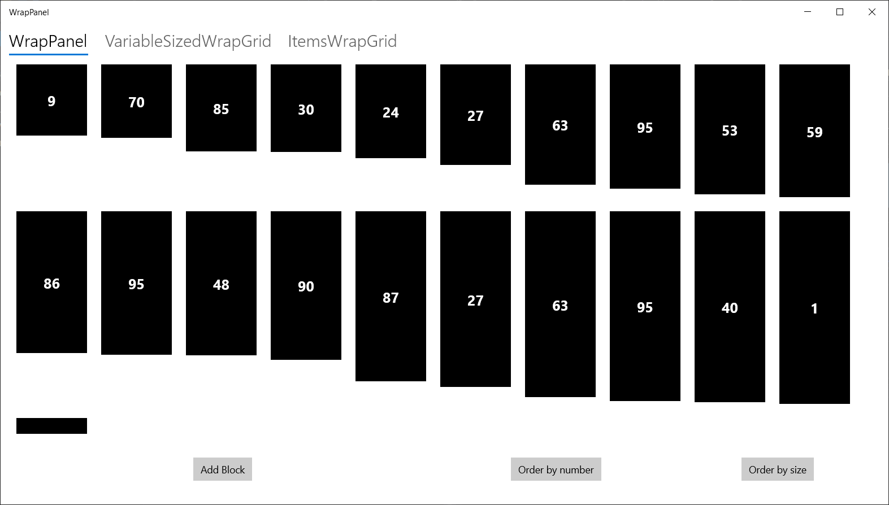

Welcome to the WrapPanel repository!

# Info
As the VariableSizedWrapGrid and ItemsWrapGrid both take either user defined sizes or take the size of the first child it isn't easy to display a collection of items with various sizes.
Exactly for this case I built the WrapPanel.

The repository contains two directories:
* WrapPanel, containing the source of the WrapPanel itself;
* WrapPanel.Example, containing an example application demonstrating the use of the WrapPanel.


# Quick-Start
In your xaml page add the following namespace: 
```xml
xmlns:wp="using:WrapPanel"
```

After, you can start using the WrapPanel:
```xml
<wp:WrapPanel ItemsSource="{x:Bind Blocks, Mode=OneWay}">
	<wp:WrapPanel.ItemTemplate>
		<DataTemplate x:DataType="local:Block">
			<Border Background="Black" Width="100" Height="{x:Bind Size}" Margin="10">
				<TextBlock Foreground="White" Text="{x:Bind Number, Mode=OneWay}" HorizontalAlignment="Center" VerticalAlignment="Center" FontSize="20" FontWeight="Bold" />
			</Border>
		</DataTemplate>
	</wp:WrapPanel.ItemTemplate>
</wp:WrapPanel>
```

Below, a screenshot of the WrapPanel in action where all children are sorted by size. 


